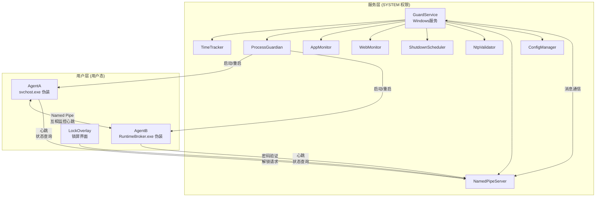
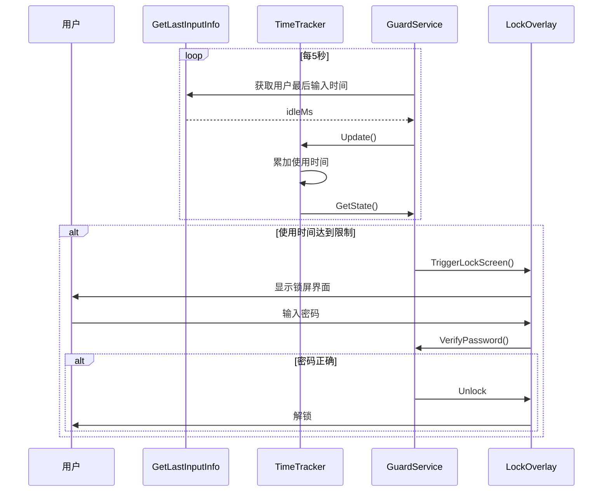
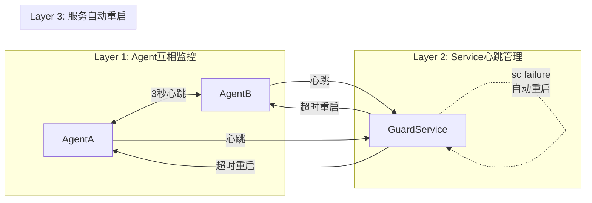
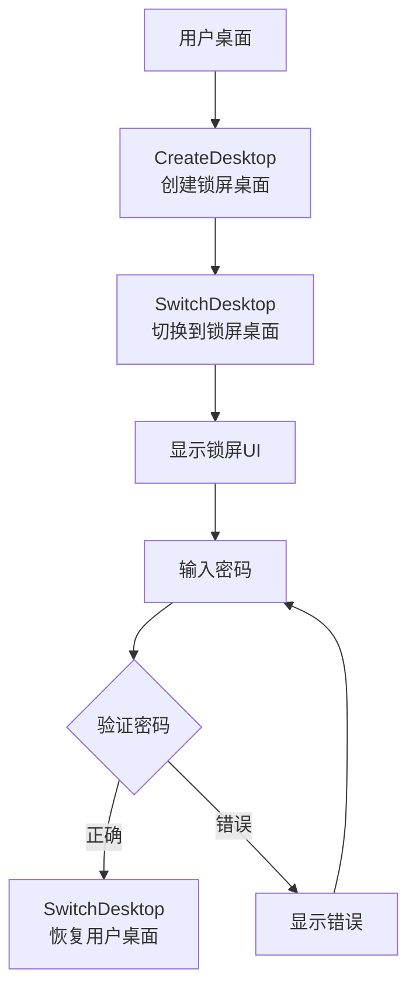

# 系统架构

## 概述

ChildPCGuard 是一个运行在 Windows 平台上的儿童电脑使用时间控制程序。它通过 Windows 服务和用户态进程的双层架构，实现对电脑使用时间的精确控制和监控。系统以 SYSTEM 权限运行核心监控引擎，配合伪装成系统进程的守护进程，实现难以被孩子发现和终止的隐蔽监控。

当孩子使用电脑达到设定的时间限制时，系统会自动显示自定义锁屏界面，要求输入家长密码才能解锁。系统还支持强制休息模式（连续使用45分钟后休息5分钟）、定时关机（每天22:00）、程序和网站黑名单等丰富的管控功能。

三层守护机制确保监控进程无法被轻易终止：AgentA 与 AgentB 互相监控、Windows 服务接收心跳并管理进程、以及服务本身的自动重启配置。

## 技术栈

**语言与运行时**
- C# .NET 8
- PowerShell (安装脚本)

**框架与库**
- Windows Service (System.ServiceProcess)
- WPF (Windows Presentation Foundation)
- Win32 API (P/Invoke)

**数据存储**
- JSON 文件 (配置文件、日志)
- Windows 注册表 (备份配置)

**系统组件**
- Windows Service (SYSTEM 权限)
- Named Pipe (进程间通信)
- Win32 Desktop API (锁屏界面)

**外部服务**
- NTP 服务器 (时间同步验证)

## 项目结构

```
ChildPCGuard/
├── ChildPCGuard.sln              # Visual Studio 解决方案
├── src/
│   ├── ChildPCGuard.Shared/      # 共享库
│   │   ├── NativeAPI.cs         # Win32 API 声明
│   │   ├── PipeMessages.cs     # 管道消息类型
│   │   ├── Models.cs           # 数据模型
│   │   └── AesEncryption.cs   # 加密工具
│   │
│   ├── ChildPCGuard.GuardService/  # Windows 服务
│   │   ├── GuardService.cs     # 主服务类
│   │   ├── TimeTracker.cs     # 使用时间追踪
│   │   ├── ProcessGuardian.cs  # 进程守护
│   │   ├── AppMonitor.cs      # 程序监控
│   │   ├── WebMonitor.cs      # 网站监控
│   │   ├── ShutdownScheduler.cs # 关机调度
│   │   ├── NtpValidator.cs    # NTP 验证
│   │   ├── NamedPipeServer.cs # 管道服务器
│   │   ├── ConfigManager.cs    # 配置管理
│   │   └── NotificationHelper.cs # 通知帮助
│   │
│   ├── ChildPCGuard.Agent/     # 守护进程
│   │   ├── Agent.cs           # Agent 实现
│   │   └── Program.cs         # 入口点
│   │
│   └── ChildPCGuard.LockOverlay/  # 锁屏界面
│       ├── LockWindow.xaml     # 锁屏 UI
│       └── LockWindow.xaml.cs  # 锁屏逻辑
│
├── scripts/
│   ├── install.ps1             # 安装脚本
│   └── uninstall.ps1           # 卸载脚本
│
└── docs/                      # 工程文档
    ├── 01-需求规格说明书.md
    ├── 02-技术设计说明书.md
    └── ...
```

**入口点**
- `ChildPCGuard.GuardService.Program.Main()` - 服务入口，支持 `--console` 调试模式
- `ChildPCGuard.Agent.Program.Main()` - Agent 入口，支持 `--agent-a` / `--agent-b` 参数
- `ChildPCGuard.LockOverlay.App.Main()` - WPF 应用入口

## 子系统

### GuardService (Windows 服务)
**目的**: 核心监控引擎，以 SYSTEM 权限运行
**位置**: `src/ChildPCGuard.GuardService/`
**关键文件**: `GuardService.cs`, `TimeTracker.cs`, `ProcessGuardian.cs`
**依赖**: Shared 库、NTP 服务器
**被依赖**: Agent、LockOverlay 通过 Named Pipe 调用

### Agent (守护进程)
**目的**: 双进程互相守护，防止被终止
**位置**: `src/ChildPCGuard.Agent/`
**关键文件**: `Agent.cs`, `Program.cs`
**依赖**: Shared 库、GuardService (管道通信)
**被依赖**: GuardService 通过进程管理

### LockOverlay (锁屏界面)
**目的**: 自定义桌面锁屏界面，验证家长密码
**位置**: `src/ChildPCGuard.LockOverlay/`
**关键文件**: `LockWindow.xaml.cs`
**依赖**: Shared 库、GuardService (管道通信)
**被依赖**: GuardService 触发启动

### Shared (共享库)
**目的**: 公共类型、Win32 API、消息定义
**位置**: `src/ChildPCGuard.Shared/`
**关键文件**: `NativeAPI.cs`, `PipeMessages.cs`, `Models.cs`
**依赖**: 无
**被依赖**: 所有其他项目

## 系统架构图



## 数据流



## 进程守护机制



## 锁屏桌面切换



## 数据存储路径

| 类型 | 路径 |
|------|------|
| 配置文件 | `C:\ProgramData\ChildPCGuard\config.json` |
| 使用数据 | `C:\ProgramData\ChildPCGuard\data\usage_data.json` |
| 进程日志 | `C:\ProgramData\ChildPCGuard\logs\YYYY-MM-DD_process.json` |
| 网站日志 | `C:\ProgramData\ChildPCGuard\logs\YYYY-MM-DD_web.json` |
| AgentA 伪装 | `C:\Windows\System32\svchost.exe` |
| AgentB 伪装 | `C:\Windows\System32\RuntimeBroker.exe` |
| 锁屏程序 | `C:\Windows\System32\LockOverlay.exe` |
