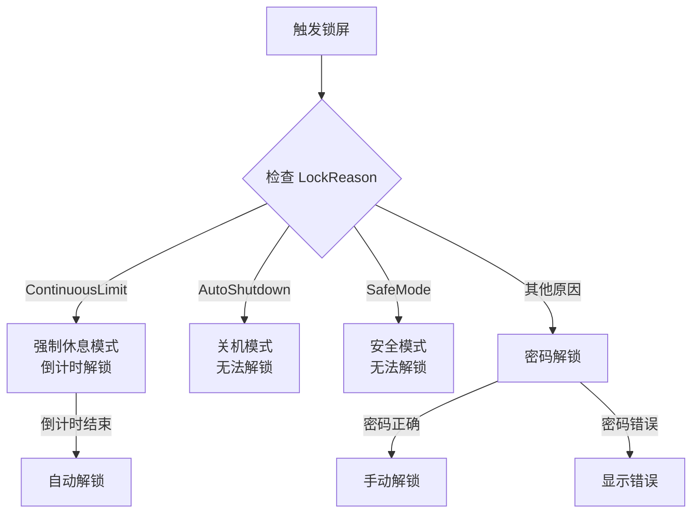

# LockReason

LockReason 是表示触发锁屏原因的枚举类型。

## 什么是 LockReason？

LockReason 枚举定义了所有可能导致锁屏的原因。当 GuardService 触发锁屏时，会传递具体原因给 LockOverlay，界面根据不同原因显示不同的提示信息或行为（如强制休息期间无法解锁）。

**关键特征**:
- 9 种锁屏原因
- 分为可解锁和不可解锁两类
- 影响 LockOverlay 的界面行为

## 代码位置

| 方面 | 位置 |
|------|------|
| 定义 | `src/ChildPCGuard.Shared/PipeMessages.cs` |
| 使用 | `src/ChildPCGuard.GuardService/GuardService.cs` |
| 使用 | `src/ChildPCGuard.LockOverlay/LockWindow.xaml.cs` |

## 值定义

```csharp
public enum LockReason
{
    DailyLimitReached = 1,    // 每日限制到达
    ContinuousLimit = 2,      // 连续限制到达
    OutsideAllowedWindow = 3,  // 超出允许时间窗口
    TimeTampered = 4,          // 时间篡改
    ManualLock = 5,             // 手动锁屏
    AutoShutdown = 6,           // 自动关机
    BlockedApp = 7,             // 黑名单程序
    BlockedSite = 8,            // 黑名单网站
    SafeMode = 9                // 安全模式
}
```

## 原因说明

| 原因 | 值 | 是否可密码解锁 | 特殊行为 |
|------|-----|--------------|----------|
| `DailyLimitReached` | 1 | 是 | - |
| `ContinuousLimit` | 2 | **否** | 强制休息，倒计时结束后自动解锁 |
| `OutsideAllowedWindow` | 3 | 是 | - |
| `TimeTampered` | 4 | 是 | - |
| `ManualLock` | 5 | 是 | - |
| `AutoShutdown` | 6 | **否** | 无法解锁，直接关机 |
| `BlockedApp` | 7 | 是 | - |
| `BlockedSite` | 8 | 是 | - |
| `SafeMode` | 9 | **否** | 无法解锁，直接关机 |

## 解锁规则



## 在代码中的使用

### GuardService 触发锁屏

```csharp
// GuardService.cs - MonitoringCallback
case UsageState.Using:
    if (stateInfo.ContinuousTime >= TimeSpan.FromMinutes(config.ContinuousLimitMinutes))
    {
        _timeTracker.StartRest();
        TriggerLockScreen(LockReason.ContinuousLimit);  // 强制休息
    }
    break;
case UsageState.Locked:
    TriggerLockScreen(LockReason.DailyLimitReached);    // 时长用尽
    break;

// 黑名单检测
if (_appMonitor.IsBlockedProcessRunning())
{
    TriggerLockScreen(LockReason.BlockedApp);
}

if (_webMonitor.IsBlockedSiteAccessed())
{
    TriggerLockScreen(LockReason.BlockedSite);
}
```

### LockOverlay 处理不同原因

```csharp
// LockWindow.xaml.cs
private void UnlockButton_Click(object sender, RoutedEventArgs e)
{
    // 强制休息期间无法解锁
    if (_lockReason == LockReason.ContinuousLimit)
    {
        ErrorText.Text = "强制休息期间无法解锁，请等待倒计时结束";
        return;
    }

    // 关机时间到无法解锁
    if (_lockReason == LockReason.AutoShutdown)
    {
        ErrorText.Text = "已到达关机时间，无法解锁";
        return;
    }

    VerifyPassword(PasswordBox.Password);
}
```

## 相关概念

- [UsageState](./UsageState.md) - 用户使用状态
- [LockOverlay](./模块/LockOverlay.md) - 锁屏界面模块
