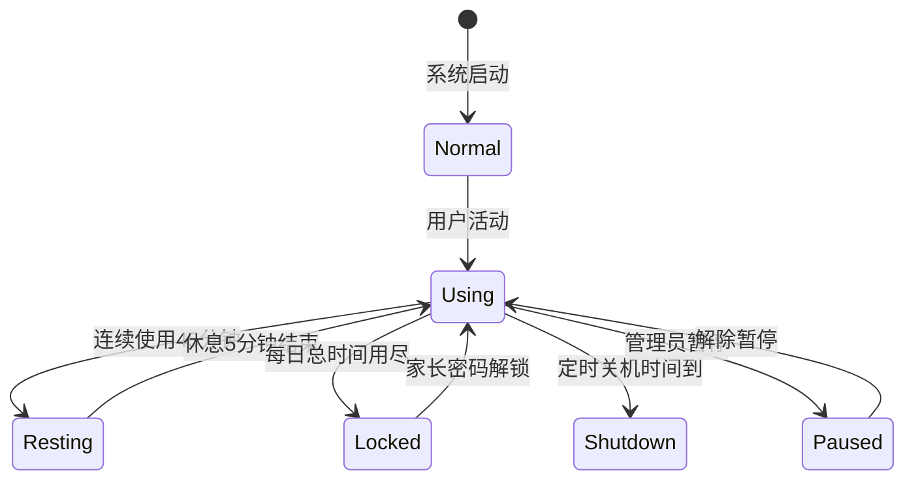

# UsageState

UsageState 是表示用户当前使用状态的枚举类型。

## 什么是 UsageState？

UsageState 枚举定义了用户使用电脑的所有可能状态。TimeTracker 组件使用这些状态来跟踪用户活动，并决定何时触发锁屏或其他操作。

**关键特征**:
- 6 种互斥状态
- 状态转换由 TimeTracker 管理
- 某些状态（如 Resting）期间无法解锁

## 代码位置

| 方面 | 位置 |
|------|------|
| 定义 | `src/ChildPCGuard.Shared/PipeMessages.cs` |
| 使用 | `src/ChildPCGuard.GuardService/TimeTracker.cs` |
| 消息传递 | `src/ChildPCGuard.Shared/StatusMessage.cs` |

## 值定义

```csharp
public enum UsageState
{
    Using = 0,      // 使用中
    Resting = 1,    // 强制休息中
    Locked = 2,     // 锁定
    Shutdown = 3,  // 关机
    Paused = 4,    // 暂停
    Normal = 10    // 正常
}
```

## 状态说明

| 状态 | 值 | 描述 | 允许的转换 |
|------|-----|------|-----------|
| `Using` | 0 | 用户正在使用电脑 | → Resting (连续时间到), → Locked (总时间到) |
| `Resting` | 1 | 强制休息中，倒计时结束自动解除 | → Using (倒计时结束) |
| `Locked` | 2 | 锁定状态，需要密码解锁 | → Using (密码正确) |
| `Shutdown` | 3 | 关机状态 | (终态) |
| `Paused` | 4 | 暂停控制 | → Using (解除暂停) |
| `Normal` | 10 | 正常状态 | (初始状态) |

## 状态转换图



## 在代码中的使用

```csharp
// TimeTracker.cs
public (UsageState State, TimeSpan UsedTime, ...) GetState()
{
    return (
        _todayData.CurrentState,
        _todayData.TotalUsedTime + TimeSpan.FromMinutes(_todayData.ExtraMinutesToday),
        _todayData.ContinuousUsedTime,
        RestRemainingTime
    );
}

// GuardService.cs - MonitoringCallback
switch (stateInfo.State)
{
    case UsageState.Using:
        if (stateInfo.ContinuousTime >= TimeSpan.FromMinutes(config.ContinuousLimitMinutes))
        {
            _timeTracker.StartRest();
            TriggerLockScreen(LockReason.ContinuousLimit);
        }
        break;
    case UsageState.Resting:
        if (stateInfo.RestRemainingTime <= TimeSpan.Zero)
        {
            _timeTracker.EndRest();
        }
        break;
}
```

## 相关概念

- [LockReason](./LockReason.md) - 锁定原因，与 UsageState 配合使用
- [TimeTracker](./TimeTracker.md) - 状态管理组件
