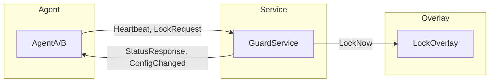

# ChildPCGuard.Shared

共享库项目，包含所有组件共用的类型和 Win32 API 声明。

## 项目信息

| 项目 | 值 |
|------|---|
| 项目文件 | `src/ChildPCGuard.Shared/ChildPCGuard.Shared.csproj` |
| 目标框架 | net8.0-windows |
| 根命名空间 | ChildPCGuard.Shared |

## 组件

### NativeAPI

Win32 API P/Invoke 声明集合。

**文件**: `NativeAPI.cs`

**主要类别**:

| 类别 | Win32 DLL | 方法数 |
|------|-----------|--------|
| 进程操作 | kernel32.dll | 6 |
| 桌面操作 | user32.dll | 6 |
| 进程监控 | ntdll.dll | 2 |
| 时间相关 | kernel32.dll | 3 |

**关键方法**:

```csharp
// 进程操作
[DllImport("kernel32.dll")]
static extern bool LockWorkStation();

[DllImport("kernel32.dll")]
static extern IntPtr OpenProcess(uint dwDesiredAccess, bool bInheritHandle, int dwProcessId);

[DllImport("kernel32.dll")]
static extern bool TerminateProcess(IntPtr hProcess, uint uExitCode);

[DllImport("kernel32.dll")]
static extern bool CreateProcess(
    string lpApplicationName, string lpCommandLine, IntPtr lpProcessAttributes,
    IntPtr lpThreadAttributes, bool bInheritHandles, uint dwCreationFlags,
    IntPtr lpEnvironment, string lpCurrentDirectory,
    ref STARTUPINFO lpStartupInfo, out PROCESS_INFORMATION lpProcessInformation);

// 桌面操作
[DllImport("user32.dll")]
static extern IntPtr CreateDesktop(string lpszDesktop, IntPtr lpszDevice,
    IntPtr pDevMode, uint dwFlags, uint dwDesiredAccess, IntPtr lpsa);

[DllImport("user32.dll")]
static extern bool SwitchDesktop(IntPtr hDesktop);

[DllImport("user32.dll")]
static extern IntPtr GetForegroundWindow();

[DllImport("user32.dll")]
static extern uint GetWindowThreadProcessId(IntPtr hWnd, out uint lpdwProcessId);

// 进程监控
[DllImport("ntdll.dll")]
static extern int NtQueryInformationProcess(IntPtr processHandle,
    int processInformationClass, IntPtr processInformation,
    uint processInformationLength, out uint returnLength);

// 输入检测
[DllImport("user32.dll")]
static extern bool GetLastInputInfo(ref LASTINPUTINFO plii);
```

**使用示例**:

```csharp
// 锁定工作站
NativeAPI.LockWorkStation();

// 打开进程
IntPtr hProcess = NativeAPI.OpenProcess(
    NativeAPI.PROCESS_QUERY_LIMITED_INFORMATION, false, processId);

// 获取前台窗口进程ID
uint processId;
NativeAPI.GetWindowThreadProcessId(NativeAPI.GetForegroundWindow(), out processId);
```

### PipeMessages

命名管道消息类型定义。

**文件**: `PipeMessages.cs`

**类型**:

| 类型 | 描述 |
|------|------|
| `PipeMessageType` | 消息类型枚举 (12种) |
| `PipeMessage` | 基类消息 |
| `HeartbeatMessage` | 心跳消息 |
| `StatusMessage` | 状态消息 |
| `LockRequestMessage` | 锁屏请求 |
| `UnlockRequestMessage` | 解锁请求 |

**消息流向**:



**使用示例**:

```csharp
// Agent 发送心跳
var heartbeat = new HeartbeatMessage
{
    Type = PipeMessageType.Heartbeat,
    ProcessName = "svchost.exe",
    ProcessId = 1234,
    MemoryUsage = 102400,
    Uptime = TimeSpan.FromMinutes(5)
};
```

### Models

数据模型定义。

**文件**: `Models.cs`

**核心类型**:

| 类型 | 描述 |
|------|------|
| `AppConfiguration` | 应用配置 |
| `RulesConfiguration` | 规则配置 |
| `TimeRule` | 时间规则 |
| `TimeWindow` | 时间窗口 |
| `DailyUsageData` | 每日使用数据 |
| `UsageState` | 使用状态枚举 |
| `LockReason` | 锁屏原因枚举 |

**UsageState 值**:

```csharp
public enum UsageState
{
    Using = 0,      // 使用中
    Resting = 1,    // 强制休息中
    Locked = 2,     // 锁定
    Shutdown = 3,   // 关机
    Paused = 4,     // 暂停
    Normal = 10     // 正常
}
```

**LockReason 值**:

```csharp
public enum LockReason
{
    DailyLimitReached = 1,    // 每日限制到达
    ContinuousLimit = 2,      // 连续限制到达
    OutsideAllowedWindow = 3, // 超出允许时间窗口
    TimeTampered = 4,         // 时间篡改
    ManualLock = 5,            // 手动锁屏
    AutoShutdown = 6,          // 自动关机
    BlockedApp = 7,            // 黑名单程序
    BlockedSite = 8,           // 黑名单网站
    SafeMode = 9               // 安全模式
}
```

### AesEncryption

AES 加密工具。

**文件**: `AesEncryption.cs`

**方法**:

```csharp
public static class AesEncryption
{
    // 加密字符串
    public static string Encrypt(string plainText, string key);

    // 解密字符串
    public static string Decrypt(string cipherText, string key);

    // 计算SHA256哈希
    public static string ComputeHash(string input);
}
```

**使用示例**:

```csharp
// 加密密码
string encrypted = AesEncryption.Encrypt("password", key);

// 验证密码
string hash = AesEncryption.ComputeHash("password");
bool valid = hash == storedHash;
```

## 依赖

无外部 NuGet 依赖，仅使用 .NET 8 内置库。

## 使用

其他项目通过项目引用使用：

```xml
<ItemGroup>
    <ProjectReference Include="..\ChildPCGuard.Shared\ChildPCGuard.Shared.csproj" />
</ItemGroup>
```
