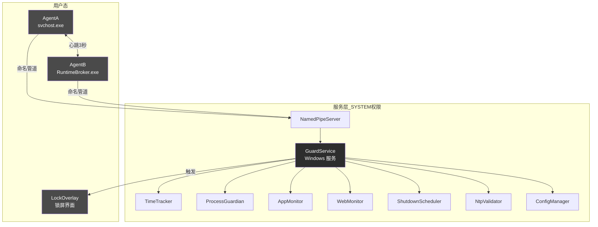
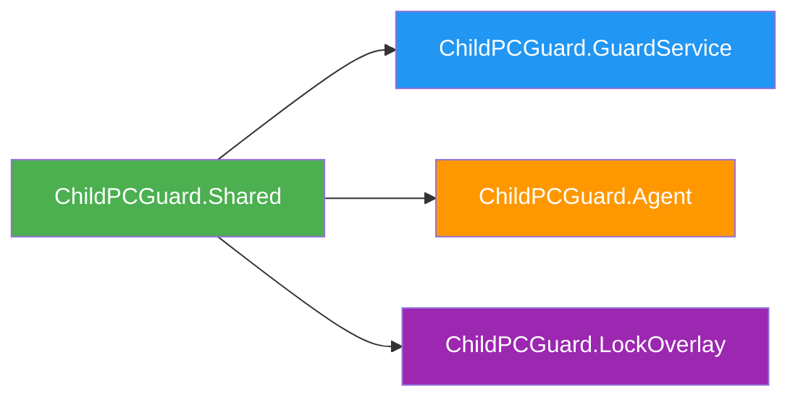
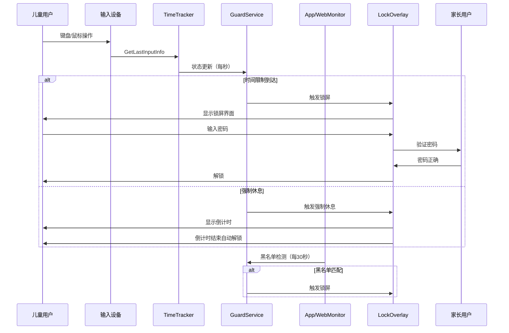
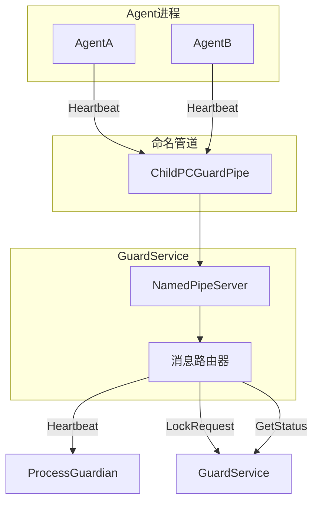
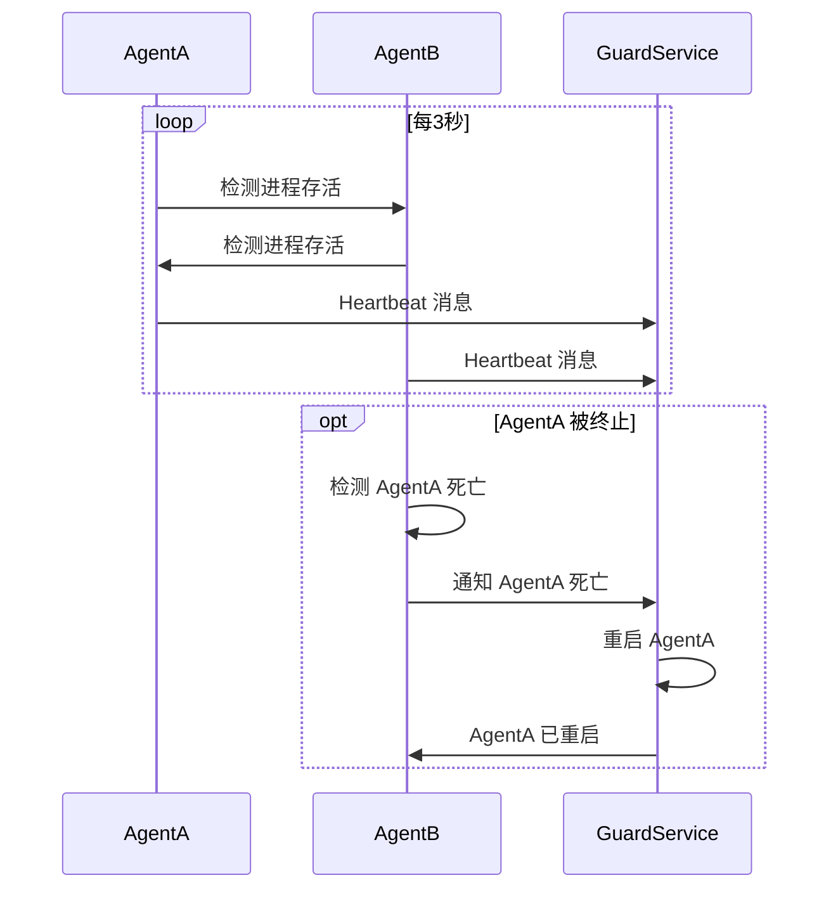
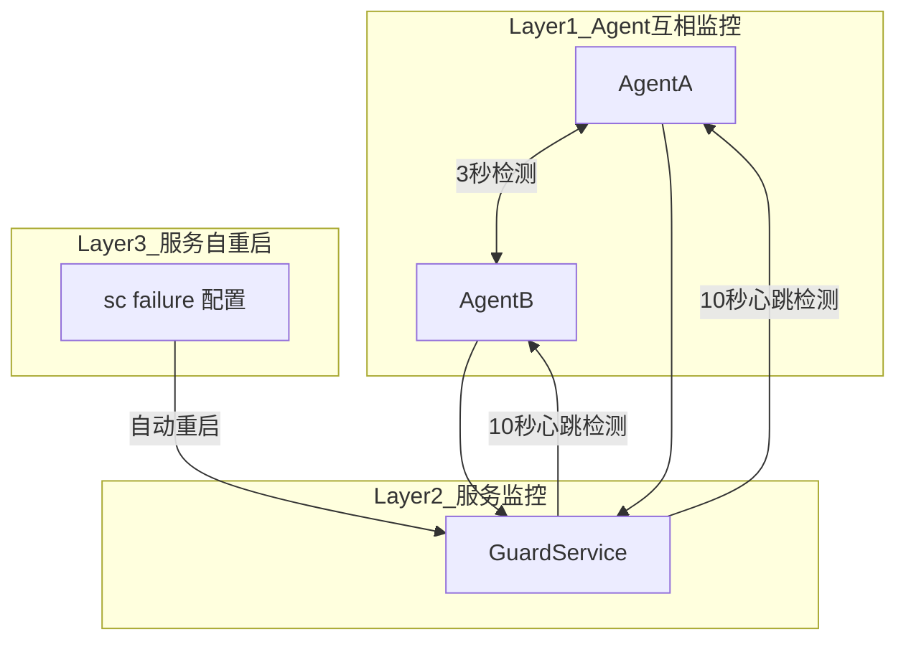
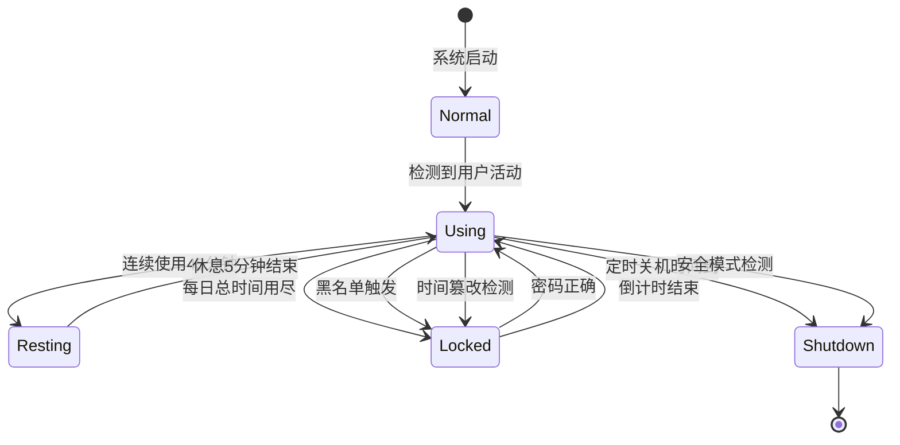

# 技术设计说明书

**项目名称**: ChildPCGuard - 儿童电脑使用时间控制程序
**版本**: 2.0
**编写日期**: 2026-05-02
**更新日期**: 2026-05-03

---

## 1. 系统架构设计

### 1.1 整体架构

ChildPCGuard 采用三层架构：Windows 服务层（SYSTEM 权限）、守护进程层（用户态）和锁屏界面层（用户态）。



### 1.2 组件说明

| 组件 | 类型 | 权限 | 职责 | 进程名 |
|------|------|------|------|--------|
| GuardService | Windows 服务 | SYSTEM | 核心监控引擎，协调所有组件 | WinSecSvc_a1b2c3d4 |
| AgentA | 用户进程 | 用户 | 守护进程A，与B互相监控 | svchost.exe（伪装） |
| AgentB | 用户进程 | 用户 | 守护进程B，与A互相监控 | RuntimeBroker.exe（伪装） |
| LockOverlay | WPF 窗口 | 用户 | 显示全屏锁屏界面，处理密码验证 | LockOverlay.exe |

### 1.3 项目引用关系



### 1.4 数据流



---

## 2. 模块设计和接口定义

### 2.1 模块结构

```
ChildPCGuard/
├── src/
│   ├── ChildPCGuard.Shared/          # 共享类库
│   │   ├── NativeAPI.cs             # Win32 API P/Invoke 声明
│   │   ├── PipeMessages.cs          # 命名管道消息定义
│   │   ├── Models.cs                # 数据模型和枚举
│   │   └── AesEncryption.cs         # AES 加密工具
│   │
│   ├── ChildPCGuard.GuardService/    # Windows 服务
│   │   ├── Program.cs               # 服务入口，--console 调试
│   │   ├── GuardService.cs          # 主服务类，组件协调
│   │   ├── ConfigManager.cs         # 配置加载/保存
│   │   ├── NamedPipeServer.cs       # 管道服务器
│   │   ├── TimeTracker.cs           # 时间追踪
│   │   ├── ProcessGuardian.cs       # 进程守护
│   │   ├── AppMonitor.cs            # 程序监控
│   │   ├── WebMonitor.cs            # 网站监控
│   │   ├── ShutdownScheduler.cs     # 关机调度
│   │   ├── NtpValidator.cs          # NTP 时间验证
│   │   └── NotificationHelper.cs    # 桌面通知
│   │
│   ├── ChildPCGuard.Agent/           # 守护进程
│   │   ├── Program.cs               # 进程入口
│   │   └── Agent.cs                 # Agent 逻辑
│   │
│   └── ChildPCGuard.LockOverlay/     # 锁屏界面
│       ├── App.xaml                 # WPF 应用
│       ├── App.xaml.cs
│       ├── LockWindow.xaml          # 锁屏界面 XAML
│       └── LockWindow.xaml.cs       # 锁屏逻辑
│
└── scripts/
    ├── install.ps1                   # 安装脚本
    └── uninstall.ps1                 # 卸载脚本
```

### 2.2 关键接口

#### Named Pipe 消息接口

**管道名称**: `ChildPCGuardPipe`
**序列化方式**: BinaryFormatter

```csharp
public enum PipeMessageType : byte
{
    Heartbeat = 1,           // Agent → Service
    LockRequest = 2,         // Agent → Service
    UnlockRequest = 3,       // Agent → Service
    RestartAgent = 4,        // Agent → Service
    ConfigChanged = 5,       // Service → Agent
    GetStatus = 6,           // Agent → Service
    StatusResponse = 7,      // Service → Agent
    LogRecord = 8,           // Agent → Service
    AddTime = 9,             // Agent → Service
    PauseControl = 10,       // Agent → Service
    LockNow = 11,            // Service → LockOverlay
    ShutdownNow = 12         // Agent → Service
}

[Serializable]
public class PipeMessage
{
    public PipeMessageType Type { get; set; }
    public string ProcessName { get; set; }
    public int ProcessId { get; set; }
    public DateTime Timestamp { get; set; }
    public string Payload { get; set; }
}

[Serializable]
public class HeartbeatMessage : PipeMessage
{
    public uint MemoryUsage { get; set; }
    public TimeSpan Uptime { get; set; }
}

[Serializable]
public class StatusMessage : PipeMessage
{
    public UsageState CurrentState { get; set; }
    public TimeSpan UsedTimeToday { get; set; }
    public TimeSpan RemainingTime { get; set; }
    public TimeSpan ContinuousUsageTime { get; set; }
    public TimeSpan RestRemainingTime { get; set; }
    public DateTime? ShutdownTime { get; set; }
    public int BlockedAppsCount { get; set; }
    public int BlockedSitesCount { get; set; }
    public bool IsServiceRunning { get; set; }
}
```

#### 配置接口

```csharp
public class AppConfiguration
{
    public string Version { get; set; } = "1.0";
    public bool IsEnabled { get; set; } = true;
    public string AdminPasswordHash { get; set; }
    public RulesConfiguration Rules { get; set; } = new RulesConfiguration();
    public string AutoShutdownTime { get; set; } = "22:00";
    public int[] WarningMinutes { get; set; } = new[] { 10, 5, 1 };
    public int IdleThresholdMs { get; set; } = 5000;
    public int ContinuousLimitMinutes { get; set; } = 45;
    public int RestDurationMinutes { get; set; } = 5;
    public List<string> BlockedApps { get; set; } = new List<string>();
    public List<string> BlockedSites { get; set; } = new List<string>();
    public bool UseNtpValidation { get; set; } = true;
    public string[] NtpServers { get; set; } = new[] { "pool.ntp.org", "time.windows.com" };
    public int NtpToleranceMinutes { get; set; } = 5;
    public string ServiceName { get; set; } = "WinSecSvc_a1b2c3d4";
    public string ServiceDisplayName { get; set; } = "Windows Security Update Service";
    public string LockScreenMessage { get; set; } = "今天的使用时间已到，休息一下吧！";
    public string EmergencyUnlockShortcut { get; set; } = "Ctrl+Alt+Shift+F12";
}

public class RulesConfiguration
{
    public TimeRule Weekdays { get; set; } = new TimeRule();
    public TimeRule Weekends { get; set; } = new TimeRule();
}

public class TimeRule
{
    public int DailyLimitMinutes { get; set; } = 120;
    public List<TimeWindow> AllowedTimeWindows { get; set; } = new List<TimeWindow>();
}

public class TimeWindow
{
    public string Start { get; set; } = "00:00";
    public string End { get; set; } = "23:59";
}
```

#### 数据模型

```csharp
public enum UsageState
{
    Using = 0,       // 使用中
    Resting = 1,     // 强制休息中
    Locked = 2,      // 锁定
    Shutdown = 3,    // 关机
    Paused = 4,      // 暂停
    Normal = 10      // 正常
}

public enum LockReason
{
    DailyLimitReached = 1,
    ContinuousLimit = 2,
    OutsideAllowedWindow = 3,
    TimeTampered = 4,
    ManualLock = 5,
    AutoShutdown = 6,
    BlockedApp = 7,
    BlockedSite = 8,
    SafeMode = 9
}

public class DailyUsageData
{
    public DateTime Date { get; set; }
    public TimeSpan TotalUsedTime { get; set; }
    public TimeSpan ContinuousUsedTime { get; set; }
    public int ExtraMinutesToday { get; set; }
    public UsageState CurrentState { get; set; }
    public DateTime? RestEndTime { get; set; }
    public DateTime SessionStart { get; set; }
    public DateTime LastInputTime { get; set; }
    public DateTime? LastNtpCheckTime { get; set; }
    public DateTime? LastNtpTime { get; set; }
}
```

---

## 3. 配置文件设计

### 3.1 主配置文件

**路径**: `C:\ProgramData\ChildPCGuard\config.json`
**加密**: AES-256-CBC

```json
{
    "Version": "1.0",
    "IsEnabled": true,
    "AdminPasswordHash": "encrypted_hash",
    "Rules": {
        "Weekdays": {
            "DailyLimitMinutes": 120,
            "AllowedTimeWindows": [
                { "Start": "15:00", "End": "20:00" }
            ]
        },
        "Weekends": {
            "DailyLimitMinutes": 240,
            "AllowedTimeWindows": [
                { "Start": "09:00", "End": "21:00" }
            ]
        }
    },
    "AutoShutdownTime": "22:00",
    "WarningMinutes": [10, 5, 1],
    "IdleThresholdMs": 5000,
    "ContinuousLimitMinutes": 45,
    "RestDurationMinutes": 5,
    "BlockedApps": [],
    "BlockedSites": [],
    "UseNtpValidation": true,
    "NtpServers": ["pool.ntp.org", "time.windows.com"],
    "NtpToleranceMinutes": 5,
    "ServiceName": "WinSecSvc_a1b2c3d4",
    "ServiceDisplayName": "Windows Security Update Service",
    "LockScreenMessage": "今天的使用时间已到，休息一下吧！",
    "EmergencyUnlockShortcut": "Ctrl+Alt+Shift+F12"
}
```

### 3.2 日志文件

**进程日志**: `C:\ProgramData\ChildPCGuard\logs\YYYY-MM-DD_process.json`

```json
{
    "Date": "2026-05-02",
    "Records": [
        {
            "Timestamp": "2026-05-02T15:30:00",
            "ProcessName": "chrome",
            "ProcessPath": "C:\\Program Files\\Google\\Chrome\\Application\\chrome.exe",
            "Duration": 3600
        }
    ]
}
```

**网站日志**: `C:\ProgramData\ChildPCGuard\logs\YYYY-MM-DD_web.json`

```json
{
    "Date": "2026-05-02",
    "Records": [
        {
            "Timestamp": "2026-05-02T15:30:00",
            "Url": "https://www.youtube.com/watch?v=xxx",
            "Domain": "youtube.com",
            "Title": "Video Title"
        }
    ]
}
```

### 3.3 使用数据

**路径**: `C:\ProgramData\ChildPCGuard\data\usage_data.json`

```json
{
    "Date": "2026-05-02",
    "TotalUsedTime": "02:30:00",
    "ContinuousUsedTime": "00:45:00",
    "SessionStart": "2026-05-02T14:00:00",
    "LastInputTime": "2026-05-02T16:30:00",
    "CurrentState": 0,
    "RestEndTime": null,
    "ExtraMinutesToday": 0,
    "LastNtpCheckTime": "2026-05-02T16:00:00",
    "LastNtpTime": "2026-05-02T16:00:00"
}
```

---

## 4. 进程间通信设计

### 4.1 管道通信架构



### 4.2 心跳机制

| 参数 | 值 |
|------|-----|
| 心跳间隔 | 3 秒 |
| 超时阈值 | 10 秒 |
| 重试策略 | 超时后立即重启 Agent |



---

## 5. 安全设计方案

### 5.1 进程伪装

| 原进程 | 伪装目标 | 路径 |
|--------|----------|------|
| AgentA.exe | svchost.exe | C:\Windows\System32\svchost.exe |
| AgentB.exe | RuntimeBroker.exe | C:\Windows\System32\RuntimeBroker.exe |

### 5.2 服务伪装

- 服务名: `WinSecSvc_a1b2c3d4`
- 显示名: `Windows Security Update Service`
- 描述: `Provides Windows security update monitoring services`

### 5.3 密码安全

- 存储方式: SHA-256 哈希
- 验证方式: 比较输入的 SHA-256 哈希值与存储值

### 5.4 三层守护机制



| 层级 | 监控频率 | 超时时间 | 动作 |
|------|----------|----------|------|
| 1 | 3 秒 | 9 秒 | Agent 互相重启 |
| 2 | 1 秒 | 10 秒 | Service 重启 Agent |
| 3 | - | - | sc 失败自动重启服务 |

---

## 6. 状态机设计

### 6.1 使用状态转换



### 6.2 状态说明

| 状态 | 值 | 描述 | 可解锁 |
|------|-----|------|--------|
| Using | 0 | 使用中 | - |
| Resting | 1 | 强制休息中 | 否，倒计时结束后自动解锁 |
| Locked | 2 | 锁定 | 是，密码验证后解锁 |
| Shutdown | 3 | 关机 | 否，终态 |
| Paused | 4 | 暂停 | 是，家长操作解除 |
| Normal | 10 | 正常 | - |

---

## 7. 错误处理

### 7.1 错误场景

| 场景 | 处理方式 |
|------|----------|
| 配置文件不存在 | 使用默认配置创建 |
| 配置文件损坏 | 使用默认配置，记录错误日志 |
| 命名管道断开 | 重新建立连接 |
| Agent 进程异常退出 | 服务自动重启 |
| NTP 服务器不可达 | 使用备用服务器，连续3次失败则跳过 |
| 浏览器历史记录锁定 | 跳过本次检测，下次继续 |
| 密码验证失败 | 显示错误提示，连续3次错误锁定5分钟 |

### 7.2 日志记录

```csharp
EventLog.WriteEntry("服务启动成功", EventLogEntryType.Information);
EventLog.WriteEntry("Agent心跳超时，正在重启", EventLogEntryType.Warning);
EventLog.WriteEntry("配置文件读取失败", EventLogEntryType.Error);
```

---

## 8. 关键 Win32 API

| 功能 | API | DLL |
|------|-----|-----|
| 获取最后输入时间 | GetLastInputInfo | user32.dll |
| 锁定工作站 | LockWorkStation | user32.dll |
| 创建桌面 | CreateDesktop | user32.dll |
| 切换桌面 | SwitchDesktop | user32.dll |
| 获取前台窗口 | GetForegroundWindow | user32.dll |
| 获取窗口进程ID | GetWindowThreadProcessId | user32.dll |
| 打开进程 | OpenProcess | kernel32.dll |
| 终止进程 | TerminateProcess | kernel32.dll |
| 创建进程 | CreateProcess | kernel32.dll |

---

## 9. 性能设计

### 9.1 资源控制

| 资源 | 设计措施 |
|------|----------|
| CPU | 定时检测间隔5秒，避免频繁轮询 |
| 内存 | 日志文件按日切割，避免单文件过大 |
| 磁盘 | JSON 文件压缩存储，定期清理7天前日志 |

### 9.2 优化策略

- TimeTracker 仅在用户活跃时累计时间，空闲状态不增加 CPU 负载
- 浏览器历史记录读取每30秒一次，避免频繁磁盘 I/O
- NTP 验证每30分钟一次，避免网络请求过多

---

## 10. 测试策略

### 10.1 单元测试

| 模块 | 测试内容 |
|------|----------|
| AesEncryption | 加密/解密往返测试 |
| TimeTracker | 状态转换、时长累计、工作日/周末切换 |
| ProcessGuardian | 心跳超时检测、Agent 重启 |
| ConfigManager | 配置加载/保存、加密解密 |

### 10.2 集成测试

| 测试项 | 验证内容 |
|--------|----------|
| 命名管道通信 | Agent ↔ Service 消息传递 |
| 锁屏触发 | 时间限制到达触发锁屏 |
| 配置热更新 | 配置变更后服务响应 |

### 10.3 系统测试

| 测试项 | 验证内容 |
|--------|----------|
| 安装流程 | 服务注册、文件复制、权限设置 |
| 时间控制 | 每日限制、强制休息、定时关机 |
| 进程保护 | Agent 被终止后自动恢复 |
| 卸载流程 | 服务删除、文件清理 |

---

*文档版本：2.0*
*状态：已确认*
