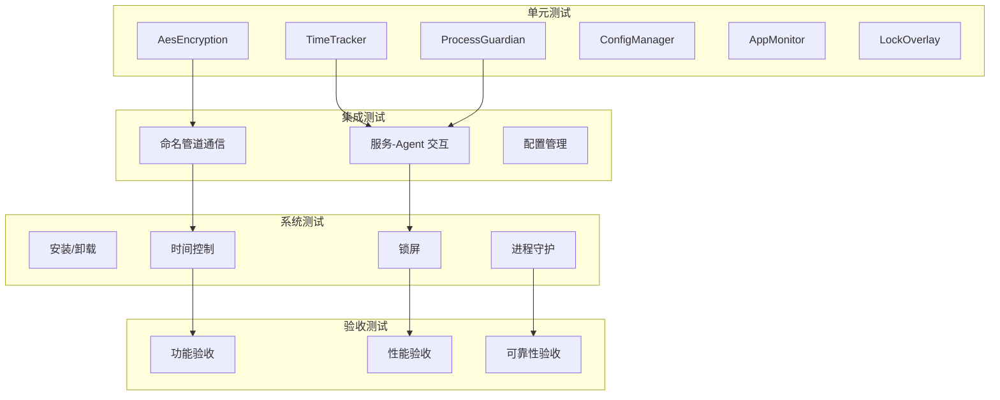
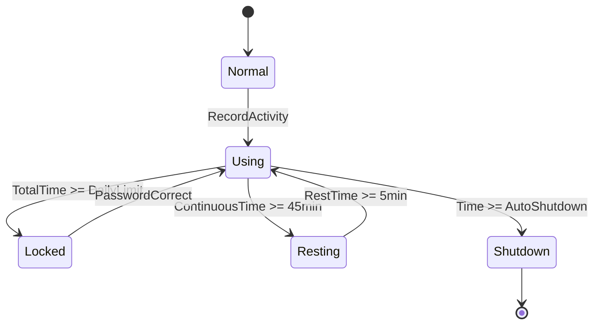

# 测试方案

**项目名称**: ChildPCGuard - 儿童电脑使用时间控制程序
**版本**: 2.0
**编写日期**: 2026-05-02
**更新日期**: 2026-05-03

---

## 1. 测试策略

### 1.1 测试层级



### 1.2 测试环境

| 环境 | 配置 | 用途 |
|------|------|------|
| 开发环境 | Windows 10/11 专业版, .NET 8 SDK | 单元测试执行 |
| 测试环境 | 独立虚拟机, Windows 10/11 专业版 | 集成和系统测试 |
| 生产环境 | Windows 10/11 专业版 | 验收测试 |

### 1.3 测试工具

| 工具 | 用途 | 版本 |
|------|------|------|
| xUnit | 单元测试框架 | 2.4+ |
| Moq | Mock 框架 | 4.18+ |
| Coverlet | 代码覆盖率 | 3.1+ |
| PowerShell | 自动化测试脚本 | 5.1+ |

---

## 2. 单元测试

### 2.1 共享库模块

#### 2.1.1 AesEncryption 测试

| 用例ID | 用例描述 | 前置条件 | 输入 | 预期输出 | 优先级 |
|--------|----------|----------|------|----------|--------|
| UT-AES-001 | 加密正常文本 | 无 | "hello world", key | 非空Base64字符串 | P0 |
| UT-AES-002 | 解密正常加密 | 已加密文本 | 密文, key | "hello world" | P0 |
| UT-AES-003 | 密钥错误解密 | 已加密文本 | 密文, wrongKey | 抛出 CryptographicException | P0 |
| UT-AES-004 | 空文本加密 | 无 | "", key | 抛出 ArgumentNullException | P1 |
| UT-AES-005 | 生成密钥 | 无 | - | 32字节Base64字符串 | P0 |
| UT-AES-006 | 加密往返测试 | 无 | "test123!@#", key | 解密后等于原文 | P0 |

#### 2.1.2 Models 测试

| 用例ID | 用例描述 | 前置条件 | 输入 | 预期输出 | 优先级 |
|--------|----------|----------|------|----------|--------|
| UT-MOD-001 | AppConfiguration默认构造 | 无 | new AppConfiguration() | Version="1.0", IsEnabled=true | P0 |
| UT-MOD-002 | UsageState枚举值 | 无 | UsageState.Using | 值为0 | P0 |
| UT-MOD-003 | LockReason枚举完整性 | 无 | Enum.GetValues(typeof(LockReason)) | 9个枚举值 | P0 |
| UT-MOD-004 | DailyUsageData默认值 | 无 | new DailyUsageData() | TotalUsedTime=TimeSpan.Zero | P1 |

#### 2.1.3 PipeMessages 测试

| 用例ID | 用例描述 | 前置条件 | 输入 | 预期输出 | 优先级 |
|--------|----------|----------|------|----------|--------|
| UT-PIP-001 | HeartbeatMessage构造 | 无 | new HeartbeatMessage() | Type=Heartbeat, ProcessId>=0 | P0 |
| UT-PIP-002 | StatusMessage构造 | 无 | new StatusMessage() | Type=StatusResponse | P0 |
| UT-PIP-003 | 消息序列化往返 | 无 | HeartbeatMessage | BinaryFormatter 反序列化成功 | P0 |

### 2.2 GuardService 模块

#### 2.2.1 TimeTracker 测试

| 用例ID | 用例描述 | 前置条件 | 输入 | 预期输出 | 优先级 |
|--------|----------|----------|------|----------|--------|
| UT-TT-001 | GetState初始状态 | 新建TimeTracker | GetState() | CurrentState=Normal | P0 |
| UT-TT-002 | 记录活动 | TimeTracker创建 | RecordActivity(now) | LastInputTime=now | P0 |
| UT-TT-003 | 累计使用时间 | TimeTracker运行 | 每秒调用RecordActivity | TotalUsedTime每秒增加 | P0 |
| UT-TT-004 | 每日限制到达 | TotalUsedTime=限制 | GetState() | CurrentState=Locked | P0 |
| UT-TT-005 | 连续使用限制 | ContinuousUsedTime=45分钟 | GetState() | CurrentState=Resting | P0 |
| UT-TT-006 | StartRest设置状态 | TimeTracker运行 | StartRest() | CurrentState=Resting | P0 |
| UT-TT-007 | EndRest重置状态 | 强制休息中 | EndRest() | CurrentState=Using, ContinuousUsedTime=0 | P0 |
| UT-TT-008 | 工作日规则 | 配置工作日120分钟 | Monday, GetState() | 使用工作日限制 | P1 |
| UT-TT-009 | 周末规则 | 配置周末240分钟 | Saturday, GetState() | 使用周末限制 | P1 |
| UT-TT-010 | 重置每日 | TotalUsedTime=60分钟 | ResetDaily() | TotalUsedTime=0 | P1 |

#### 2.2.2 ProcessGuardian 测试

| 用例ID | 用例描述 | 前置条件 | 输入 | 预期输出 | 优先级 |
|--------|----------|----------|------|----------|--------|
| UT-PG-001 | 更新心跳 | AgentInfo存在 | UpdateHeartbeat("AgentA") | LastHeartbeat=now | P0 |
| UT-PG-002 | 心跳正常 | 上次心跳<10秒 | CheckAgents() | 不触发重启 | P0 |
| UT-PG-003 | 心跳超时 | 上次心跳>10秒 | CheckAgents() | 触发 OnAgentDead 事件 | P0 |
| UT-PG-004 | 重启Agent | Agent进程已退出 | RestartAgent("AgentA") | 新进程启动 | P0 |

#### 2.2.3 AppMonitor 测试

| 用例ID | 用例描述 | 前置条件 | 输入 | 预期输出 | 优先级 |
|--------|----------|----------|------|----------|--------|
| UT-AM-001 | 黑名单匹配 | 黑名单=["chrome.exe"] | IsProcessBlocked("chrome.exe") | true | P0 |
| UT-AM-002 | 黑名单不匹配 | 黑名单=["chrome.exe"] | IsProcessBlocked("notepad.exe") | false | P0 |
| UT-AM-003 | 获取前台窗口 | 有前台窗口 | GetForegroundProcess() | 非空ProcessInfo | P0 |
| UT-AM-004 | 空黑名单 | 黑名单=[] | IsProcessBlocked("any.exe") | false | P1 |

#### 2.2.4 WebMonitor 测试

| 用例ID | 用例描述 | 前置条件 | 输入 | 预期输出 | 优先级 |
|--------|----------|----------|------|----------|--------|
| UT-WM-001 | 网站匹配 | 黑名单=["youtube.com"] | IsSiteBlocked("youtube.com") | true | P0 |
| UT-WM-002 | 网站不匹配 | 黑名单=["youtube.com"] | IsSiteBlocked("google.com") | false | P0 |
| UT-WM-003 | 子域名匹配 | 黑名单=["youtube.com"] | IsSiteBlocked("www.youtube.com") | true | P1 |

#### 2.2.5 ShutdownScheduler 测试

| 用例ID | 用例描述 | 前置条件 | 输入 | 预期输出 | 优先级 |
|--------|----------|----------|------|----------|--------|
| UT-SS-001 | 到达关机时间 | AutoShutdownTime=22:00 | 当前22:00, ShouldShutdown() | true | P0 |
| UT-SS-002 | 未到达关机时间 | AutoShutdownTime=22:00 | 当前21:59, ShouldShutdown() | false | P0 |
| UT-SS-003 | 警告时间到达 | WarningMinutes=[10,5,1] | 当前21:50 | 显示警告通知 | P1 |

#### 2.2.6 NtpValidator 测试

| 用例ID | 用例描述 | 前置条件 | 输入 | 预期输出 | 优先级 |
|--------|----------|----------|------|----------|--------|
| UT-NV-001 | 时间正常 | NTP差值<5分钟 | ValidateTime() | true | P0 |
| UT-NV-002 | 时间篡改 | NTP差值>5分钟 | ValidateTime() | false | P0 |
| UT-NV-003 | NTP服务器不可达 | 网络断开 | ValidateTime() | 使用备用服务器 | P1 |

### 2.3 Agent 模块

| 用例ID | 用例描述 | 前置条件 | 输入 | 预期输出 | 优先级 |
|--------|----------|----------|------|----------|--------|
| UT-AGT-001 | 解析AgentA参数 | 无 | "--agent-a" | Role=AgentA | P0 |
| UT-AGT-002 | 解析AgentB参数 | 无 | "--agent-b" | Role=AgentB | P0 |
| UT-AGT-003 | 心跳发送 | Agent运行 | 运行30秒 | 发送10次心跳 | P0 |
| UT-AGT-004 | 配对进程检测 | 配对进程存活 | CheckPeerProcess() | PeerAlive=true | P0 |
| UT-AGT-005 | 配对进程死亡 | 配对进程退出 | CheckPeerProcess() | PeerAlive=false, 触发重启 | P0 |

### 2.4 LockOverlay 模块

| 用例ID | 用例描述 | 前置条件 | 输入 | 预期输出 | 优先级 |
|--------|----------|----------|------|----------|--------|
| UT-LO-001 | 密码验证正确 | 存储正确哈希 | 输入正确密码 | Unlock成功 | P0 |
| UT-LO-002 | 密码验证错误 | 存储正确哈希 | 输入错误密码 | 显示错误提示 | P0 |
| UT-LO-003 | 3次错误锁定 | 错误计数器=0 | 连续3次错误密码 | Locked=true, 5分钟倒计时 | P0 |
| UT-LO-004 | 锁定期间解锁 | 处于锁定状态 | 输入正确密码 | 拒绝解锁 | P0 |
| UT-LO-005 | 锁定超时解锁 | 锁定中，等待5分钟 | 5分钟后输入 | Locked=false | P0 |
| UT-LO-006 | 紧急解锁检测 | 无 | Ctrl+Alt+Shift+F12 x5 | 显示紧急对话框 | P1 |
| UT-LO-007 | 强制休息不可解锁 | LockReason=ContinuousLimit | 输入正确密码 | 拒绝解锁 | P1 |
| UT-LO-008 | 关机时间到不可解锁 | LockReason=AutoShutdown | 输入正确密码 | 拒绝解锁 | P1 |

---

## 3. 集成测试

### 3.1 命名管道通信

| 用例ID | 用例描述 | 前置条件 | 测试步骤 | 验证点 | 优先级 |
|--------|----------|----------|----------|--------|--------|
| IT-PIPE-001 | 管道连接 | Service运行 | 1.Agent连接管道 | 连接成功 | P0 |
| IT-PIPE-002 | 心跳消息 | 管道已连接 | 1.Agent发送Heartbeat | Service收到并处理 | P0 |
| IT-PIPE-003 | 状态查询 | 管道已连接 | 1.Agent发送GetStatus 2.Service返回StatusResponse | Agent收到状态 | P0 |
| IT-PIPE-004 | 锁屏请求 | 管道已连接 | 1.Agent发送LockRequest | Service触发锁屏 | P0 |
| IT-PIPE-005 | 配置变更通知 | 管道已连接 | 1.Service发送ConfigChanged | Agent收到通知 | P1 |

### 3.2 服务与Agent交互

| 用例ID | 用例描述 | 前置条件 | 测试步骤 | 验证点 | 优先级 |
|--------|----------|----------|----------|--------|--------|
| IT-SA-001 | Agent启动 | Service运行 | 1.启动AgentA 2.启动AgentB | 两个Agent都连接Service | P0 |
| IT-SA-002 | 心跳传输 | Agent运行 | 1.运行30秒 2.检查Service心跳记录 | 收到10次心跳 | P0 |
| IT-SA-003 | Agent死亡检测 | Agent运行 | 1.结束AgentA 2.等待5秒 | Service检测到并重启 | P0 |
| IT-SA-004 | 双Agent互相监控 | 两个Agent运行 | 1.结束AgentA 2.AgentB检测 | AgentB通知Service | P0 |

### 3.3 配置管理

| 用例ID | 用例描述 | 前置条件 | 测试步骤 | 验证点 | 优先级 |
|--------|----------|----------|----------|--------|--------|
| IT-CFG-001 | 加载配置 | 配置文件存在 | 1.Service启动 2.读取配置 | config.json被解析 | P0 |
| IT-CFG-002 | 保存配置 | 配置已修改 | 1.Save(config) 2.读取文件 | config.json内容更新 | P0 |
| IT-CFG-003 | 配置加密 | 配置文件存在 | 1.打开config.json 2.查看内容 | 密码字段为密文 | P0 |
| IT-CFG-004 | 配置热更新 | 服务运行 | 1.修改config.json 2.等待检测周期 | Service应用新配置 | P1 |
| IT-CFG-005 | 损坏配置恢复 | 配置文件损坏 | 1.破坏JSON格式 2.Service启动 | 使用默认配置 | P1 |

---

## 4. 系统测试

### 4.1 安装测试

| 用例ID | 用例描述 | 前置条件 | 测试步骤 | 验证点 | 优先级 |
|--------|----------|----------|----------|--------|--------|
| ST-INS-001 | 全新安装 | 未安装系统 | 1.运行install.ps1 | 服务注册成功，状态Running | P0 |
| ST-INS-002 | 安装指定密码 | 未安装系统 | 1.install.ps1 -Password "test123" | config.json密码正确 | P0 |
| ST-INS-003 | 进程伪装 | 系统已安装 | 1.打开任务管理器 2.查看进程名 | 显示svchost.exe/RuntimeBroker.exe | P0 |
| ST-INS-004 | 服务自启动 | 系统已安装 | 1.重启电脑 2.检查服务状态 | 服务自动运行 | P0 |
| ST-INS-005 | 卸载 | 系统已安装 | 1.运行uninstall.ps1 | 服务删除，文件清理 | P0 |

### 4.2 时间控制测试

| 用例ID | 用例描述 | 前置条件 | 测试步骤 | 验证点 | 优先级 |
|--------|----------|----------|----------|--------|--------|
| ST-TIME-001 | 每日时长限制 | 配置10分钟 | 1.使用电脑10分钟 | 10分钟后锁屏 | P0 |
| ST-TIME-002 | 强制休息触发 | 配置45分钟连续限制 | 1.连续使用45分钟 | 45分钟后进入强制休息 | P0 |
| ST-TIME-003 | 强制休息倒计时 | 强制休息中 | 1.查看锁屏界面 | 显示倒计时 | P0 |
| ST-TIME-004 | 强制休息解锁 | 强制休息中 | 1.等待5分钟 | 自动解锁 | P0 |
| ST-TIME-005 | 定时关机 | 配置22:00关机 | 1.设置系统时间21:59 2.等待 | 22:00执行关机 | P0 |
| ST-TIME-006 | 工作日规则 | 配置工作日120分钟 | 1.周一使用120分钟 | 锁屏 | P1 |
| ST-TIME-007 | 周末规则 | 配置周末240分钟 | 1.周六使用240分钟 | 锁屏 | P1 |

### 4.3 锁屏测试

| 用例ID | 用例描述 | 前置条件 | 测试步骤 | 验证点 | 优先级 |
|--------|----------|----------|----------|--------|--------|
| ST-LOCK-001 | 锁屏显示 | 触发锁屏 | 1.查看屏幕 | 全屏锁屏界面 | P0 |
| ST-LOCK-002 | 密码解锁 | 锁屏界面显示 | 1.输入正确密码 2.点击解锁 | 锁屏关闭 | P0 |
| ST-LOCK-003 | 密码错误提示 | 锁屏界面显示 | 1.输入错误密码 | 显示"密码错误" | P0 |
| ST-LOCK-004 | 3次错误锁定 | 错误计数器=0 | 1.连续输入3次错误密码 | 显示"请等待5分钟" | P0 |
| ST-LOCK-005 | 紧急解锁 | 锁屏界面显示 | 1.Ctrl+Alt+Shift+F12 x5 | 紧急对话框显示 | P1 |
| ST-LOCK-006 | 强制休息不可解锁 | 强制休息中 | 1.输入正确密码 | 显示"强制休息期间无法解锁" | P1 |

### 4.4 进程守护测试

| 用例ID | 用例描述 | 前置条件 | 测试步骤 | 验证点 | 优先级 |
|--------|----------|----------|----------|--------|--------|
| ST-GUARD-001 | Agent死亡恢复 | 系统已安装 | 1.结束AgentA进程 2.等待5秒 | AgentA自动重启 | P0 |
| ST-GUARD-002 | 双进程互相守护 | 两个Agent运行 | 1.结束AgentA 2.AgentB检测 | AgentB通知Service | P0 |
| ST-GUARD-003 | 服务自重启 | 服务停止 | 1.停止服务 2.等待 | sc配置自动重启 | P0 |

### 4.5 黑名单测试

| 用例ID | 用例描述 | 前置条件 | 测试步骤 | 验证点 | 优先级 |
|--------|----------|----------|----------|--------|--------|
| ST-BLACK-001 | 程序黑名单 | 添加chrome到黑名单 | 1.运行chrome | 立即锁屏 | P0 |
| ST-BLACK-002 | 网站黑名单 | 添加youtube到黑名单 | 1.访问youtube | 检测到后锁屏 | P1 |

---

## 5. 验收测试

### 5.1 功能验收

| 需求ID | 验收条件 | 测试方法 | 通过标准 |
|--------|----------|----------|----------|
| REQ-001 | 累计使用达到限制后锁屏 | 配置10分钟，使用10分钟 | 锁屏界面显示 |
| REQ-002 | 连续使用45分钟后强制休息 | 配置45分钟，连续使用45分钟 | 强制休息倒计时显示 |
| REQ-003 | 到达关机时间自动关机 | 配置22:00，等待到22:00 | 系统关机 |
| REQ-004 | 使用时间统计准确 | 使用5分钟 | 日志记录5分钟 |
| REQ-010 | Agent被结束自动重启 | 结束Agent进程 | 5秒内重启 |
| REQ-021 | 正确密码解锁 | 输入正确密码 | 锁屏关闭 |
| REQ-023 | 3次密码错误锁定5分钟 | 输入3次错误密码 | 5分钟内无法解锁 |
| REQ-024 | 紧急解锁可用 | Ctrl+Alt+Shift+F12 x5 | 紧急对话框显示密码 |

### 5.2 性能验收

| 指标 | 验收标准 | 测试方法 | 通过标准 |
|------|----------|----------|----------|
| CPU占用 | 运行时小于1% | 任务管理器观察10分钟 | 平均<1%，峰值<5% |
| 内存占用 | 小于50MB | 任务管理器查看 | 所有进程总和<50MB |
| 锁屏响应 | 触发后2秒内 | 触发锁屏并计时 | <2秒 |

### 5.3 可靠性验收

| 指标 | 验收标准 | 测试方法 | 通过标准 |
|------|----------|----------|----------|
| 连续运行 | 24小时无崩溃 | 运行24小时 | 无崩溃，日志正常 |
| 进程恢复 | Agent被结束5秒内恢复 | 手动结束Agent | 5秒内重启 |
| 数据完整性 | 断电后数据不丢失 | 断电恢复后检查 | 使用时间数据正确 |

---

## 6. 测试用例设计方法

### 6.1 等价类划分

| 输入字段 | 有效等价类 | 无效等价类 |
|----------|------------|------------|
| 每日限制(分钟) | 1-1440 | 0, 负数, >1440 |
| 连续限制(分钟) | 1-480 | 0, 负数, >480 |
| 休息时长(分钟) | 1-60 | 0, 负数, >60 |
| 关机时间 | 00:00-23:59 | 24:00, 25:00, 格式错误 |
| 密码长度 | 6-20字符 | <6, >20 |
| NTP容差(分钟) | 1-60 | 0, >60 |

### 6.2 边界值分析

| 输入字段 | 最小值 | 最小+1 | 正常值 | 最大-1 | 最大值 |
|----------|--------|--------|--------|--------|--------|
| 每日限制 | 1 | 2 | 120 | 1439 | 1440 |
| 连续限制 | 1 | 2 | 45 | 479 | 480 |
| 休息时长 | 1 | 2 | 5 | 59 | 60 |
| 密码长度 | 6 | 7 | 8 | 19 | 20 |

### 6.3 状态转换测试



| 测试场景 | 初始状态 | 事件 | 预期状态 |
|----------|----------|------|----------|
| 首次使用 | Normal | 检测到用户活动 | Using |
| 时间到 | Using | TotalTime >= DailyLimit | Locked |
| 强制休息 | Using | ContinuousTime >= 45min | Resting |
| 休息结束 | Resting | RestTime >= 5min | Using |
| 密码解锁 | Locked | 密码正确 | Using |
| 定时关机 | Using | Time >= AutoShutdown | Shutdown |

---

## 7. 测试执行流程

### 7.1 单元测试执行

```powershell
# 执行所有单元测试
dotnet test

# 执行带覆盖率报告
dotnet test --collect:"XPlat Code Coverage"

# 查看覆盖率报告
# 生成路径: TestResults/Coverage/report/index.html
```

### 7.2 集成测试执行

```powershell
# 启动服务（控制台模式）
cd src/ChildPCGuard.GuardService
dotnet run -- --console

# 在另一个终端启动Agent
cd src/ChildPCGuard.Agent
dotnet run -- --agent-a

# 执行集成测试脚本
.\tests\integration-tests.ps1
```

### 7.3 系统测试执行

```powershell
# 安装系统
cd scripts
.\install.ps1 -Password "test123"

# 执行系统测试脚本
.\tests\system-tests.ps1
```

---

*文档版本：2.0*
*状态：已确认*
