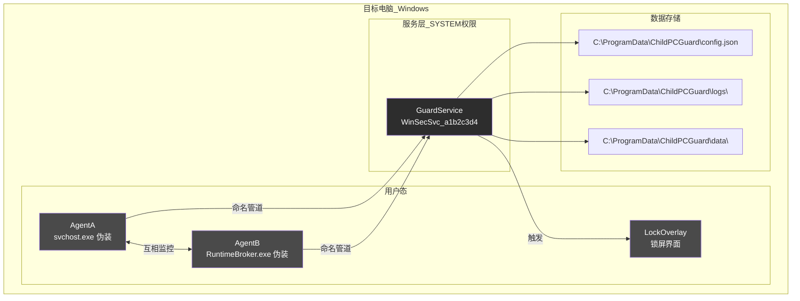
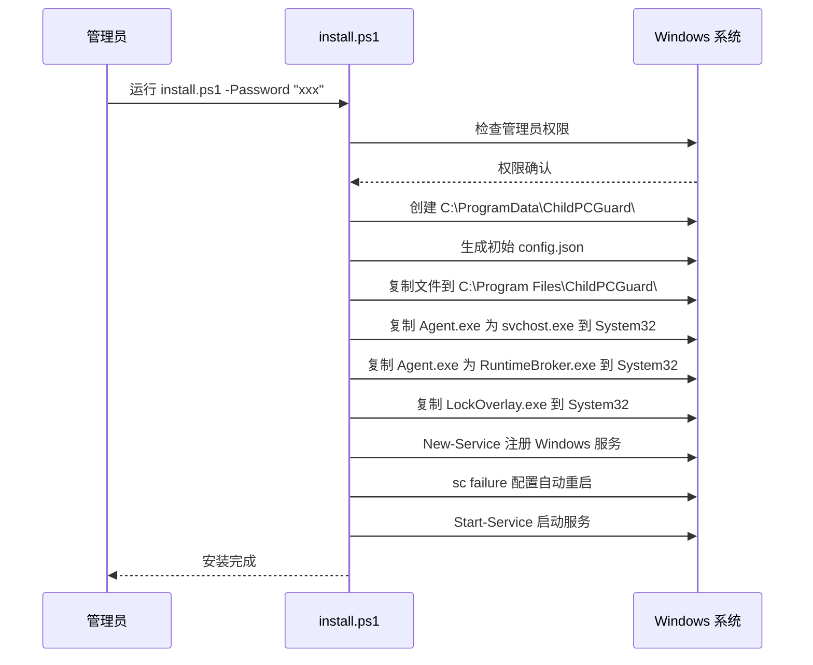

# 部署方案

**项目名称**: ChildPCGuard - 儿童电脑使用时间控制程序
**版本**: 2.0
**编写日期**: 2026-05-02
**更新日期**: 2026-05-03

---

## 1. 部署架构

### 1.1 部署拓扑



### 1.2 组件部署位置

| 组件 | 项目文件 | 输出文件 | 部署路径 |
|------|----------|----------|----------|
| GuardService | ChildPCGuard.GuardService.csproj | ChildPCGuard.GuardService.exe | C:\Program Files\ChildPCGuard\ |
| Agent | ChildPCGuard.Agent.csproj | Agent.exe | C:\Program Files\ChildPCGuard\ |
| LockOverlay | ChildPCGuard.LockOverlay.csproj | LockOverlay.exe | C:\Program Files\ChildPCGuard\ |
| 共享库 | ChildPCGuard.Shared.csproj | ChildPCGuard.Shared.dll | C:\Program Files\ChildPCGuard\ |

### 1.3 伪装部署位置

| 原文件 | 伪装目标 | 部署路径 | 说明 |
|--------|----------|----------|------|
| Agent.exe | svchost.exe | C:\Windows\System32\svchost.exe | AgentA 伪装 |
| Agent.exe | RuntimeBroker.exe | C:\Windows\System32\RuntimeBroker.exe | AgentB 伪装 |
| LockOverlay.exe | LockOverlay.exe | C:\Windows\System32\LockOverlay.exe | 锁屏界面 |

### 1.4 数据目录结构

```
C:\ProgramData\ChildPCGuard\
├── config.json              # 主配置文件（AES-256-CBC 加密）
├── logs\                    # 日志目录
│   ├── YYYY-MM-DD_process.json  # 程序使用日志
│   └── YYYY-MM-DD_web.json      # 网站访问日志
└── data\                    # 数据目录
    └── usage_data.json      # 当日使用数据
```

---

## 2. 部署流程

### 2.1 环境检查

| 检查项 | 要求 | 检查命令 | 通过标准 |
|--------|------|----------|----------|
| 操作系统 | Windows 10/11 专业版 | `systeminfo \| findstr /B /C:"OS Name"` | 包含 "Professional" |
| 管理员权限 | 当前用户为管理员 | `whoami /groups \| findstr "Administrators"` | 输出包含 S-1-5-32-544 |
| .NET 8 运行时 | 已安装 | `dotnet --list-runtimes` | 包含 Microsoft.NETCore.App 8.x |
| 磁盘空间 | 至少 100MB 可用 | `Get-PSDrive C \| Select Used,Free` | Free > 100MB |

### 2.2 编译

```bash
# 克隆仓库
git clone https://github.com/duckytan/child-computer-control.git
cd child-computer-control/ChildPCGuard

# 还原依赖
dotnet restore

# 编译 Release 版本
dotnet build -c Release

# 发布所有项目到 output 目录
dotnet publish -c Release -o output
```

### 2.3 安装

**安装前准备**：
1. 以管理员身份打开 PowerShell
2. 切换到安装文件目录
3. 准备管理员密码

**执行安装**：

```powershell
# 基本安装（默认密码：admin）
.\install.ps1

# 指定密码安装
.\install.ps1 -Password "your_secure_password"
```

**安装脚本执行流程**：



### 2.4 安装后验证

```powershell
# 1. 检查服务状态
Get-Service -Name "WinSecSvc_a1b2c3d4"
# 预期：Status = Running, StartType = Automatic

# 2. 检查进程
Get-Process | Where-Object {
    $_.ProcessName -eq "svchost" -or $_.ProcessName -eq "RuntimeBroker"
} | Select-Object Id, ProcessName, Path

# 3. 检查数据目录
Test-Path "C:\ProgramData\ChildPCGuard\config.json"
# 预期：True

# 4. 检查服务失败配置
sc failure WinSecSvc_a1b2c3d4
# 预期：RESET_PERIOD > 0, REBOOT_MESSAGE 存在
```

### 2.5 配置修改

安装完成后，如需修改配置：

```powershell
# 编辑配置文件
notepad C:\ProgramData\ChildPCGuard\config.json
```

修改后保存，服务会在下一个检测周期（约 5 秒）自动应用新配置。

---

## 3. 更新部署

### 3.1 更新流程

```powershell
# 1. 停止服务
net stop WinSecSvc_a1b2c3d4

# 2. 备份当前版本
Copy-Item "C:\Program Files\ChildPCGuard" "C:\Program Files\ChildPCGuard.bak" -Recurse

# 3. 复制新版本文件
Copy-Item ".\output\*" "C:\Program Files\ChildPCGuard\" -Force

# 4. 启动服务
net start WinSecSvc_a1b2c3d4

# 5. 验证服务状态
Get-Service -Name "WinSecSvc_a1b2c3d4"
```

### 3.2 更新注意事项

- 更新前备份当前版本
- 更新时保持配置文件不变
- 更新后验证服务状态和进程

---

## 4. 回滚方案

### 4.1 回滚触发条件

| 场景 | 严重程度 | 触发回滚 |
|------|----------|----------|
| 安装后服务无法启动 | 高 | 是 |
| 配置文件损坏导致功能异常 | 高 | 是 |
| 进程伪装失败被识别 | 中 | 是 |
| 性能严重下降（CPU > 10%） | 中 | 是 |
| 功能异常影响正常使用 | 高 | 是 |

### 4.2 回滚步骤

**方法一：使用卸载脚本**

```powershell
# 卸载当前版本
.\uninstall.ps1 -Password "your_password"

# 重新安装旧版本
.\install.ps1 -Password "your_password"
```

**方法二：手动回滚**

```powershell
# 1. 停止服务
net stop WinSecSvc_a1b2c3d4

# 2. 删除服务
sc delete WinSecSvc_a1b2c3d4

# 3. 删除伪装文件
Remove-Item "C:\Windows\System32\svchost.exe" -Force
Remove-Item "C:\Windows\System32\RuntimeBroker.exe" -Force
Remove-Item "C:\Windows\System32\LockOverlay.exe" -Force

# 4. 删除安装目录
Remove-Item "C:\Program Files\ChildPCGuard" -Recurse -Force

# 5. 删除数据目录（可选）
Remove-Item "C:\ProgramData\ChildPCGuard" -Recurse -Force
```

### 4.3 回滚后验证

| 验证项 | 验证方法 | 预期结果 |
|--------|----------|----------|
| 服务列表 | `Get-Service WinSecSvc_a1b2c3d4` | 服务不存在 |
| 进程列表 | 任务管理器 | 无异常 svchost.exe/RuntimeBroker.exe |
| 文件残留 | `Test-Path "C:\Program Files\ChildPCGuard"` | False |
| 数据目录 | `Test-Path "C:\ProgramData\ChildPCGuard"` | False（如选择删除） |

---

## 5. 应急响应

### 5.1 服务无法启动

**症状**：服务状态为"已停止"，尝试启动失败

**排查步骤**：
1. 检查事件日志：
   ```powershell
   Get-EventLog -LogName Application -Source "WinSecSvc_a1b2c3d4" -Newest 20
   ```
2. 检查配置文件是否存在：
   ```powershell
   Test-Path "C:\ProgramData\ChildPCGuard\config.json"
   ```
3. 检查 .NET 运行时是否安装：
   ```powershell
   dotnet --list-runtimes
   ```

**解决方案**：
```powershell
# 重新注册服务
sc delete WinSecSvc_a1b2c3d4
New-Service -Name "WinSecSvc_a1b2c3d4" `
    -BinaryPathName "C:\Program Files\ChildPCGuard\ChildPCGuard.GuardService.exe" `
    -DisplayName "Windows Security Update Service" `
    -StartType Automatic
Start-Service -Name "WinSecSvc_a1b2c3d4"
```

### 5.2 进程不断重启

**症状**：Agent 进程反复退出重启，日志中出现大量"Agent heartbeat timeout"

**排查步骤**：
1. 检查两个 Agent 进程是否同时存在
2. 检查命名管道是否正常
3. 检查服务与 Agent 通信日志

**解决方案**：
```powershell
# 重启服务
net stop WinSecSvc_a1b2c3d4
net start WinSecSvc_a1b2c3d4

# 如果问题持续，检查配置文件是否损坏
# 必要时重新安装
```

### 5.3 锁屏界面无法显示

**症状**：触发锁屏条件但无锁屏界面，用户可继续使用电脑

**排查步骤**：
1. 检查 LockOverlay.exe 是否存在：
   ```powershell
   Test-Path "C:\Windows\System32\LockOverlay.exe"
   ```
2. 检查桌面切换 API 是否可用
3. 查看事件日志错误

**解决方案**：
```powershell
# 手动触发锁屏测试
& "C:\Windows\System32\LockOverlay.exe" 1

# 如果文件丢失，重新安装
```

### 5.4 忘记密码

**解决方案**：
1. 使用紧急解锁：连续按 `Ctrl + Alt + Shift + F12` 5 次
2. 如果紧急解锁失效，安全模式卸载重装

### 5.5 配置损坏

**症状**：服务启动后立即崩溃，日志显示 JSON 解析错误

**解决方案**：
```powershell
# 备份损坏的配置
Copy-Item "C:\ProgramData\ChildPCGuard\config.json" "C:\ProgramData\ChildPCGuard\config.json.bak"

# 使用默认配置替换
# （需要重新配置所有参数）
```

---

## 6. 运维检查清单

### 6.1 日常检查

| 检查项 | 频率 | 检查方法 | 告警阈值 |
|--------|------|----------|----------|
| 服务运行状态 | 每天 | `Get-Service WinSecSvc_a1b2c3d4` | Status != Running |
| Agent 进程 | 每天 | 任务管理器检查 | 进程不存在 |
| 日志文件大小 | 每周 | `Get-ChildItem logs\ \| Measure-Object Length -Sum` | > 50MB |
| 磁盘空间 | 每周 | `Get-PSDrive C` | 可用 < 1GB |

### 6.2 定期维护

| 维护项 | 频率 | 操作方法 | 说明 |
|--------|------|----------|------|
| 日志清理 | 每月 | 删除 30 天前的日志文件 | 保留最近 30 天记录 |
| 配置备份 | 每月 | 复制 config.json 到备份位置 | 防止配置丢失 |
| 安全更新 | 按需 | 检查 Windows 更新 | 保持系统安全 |
| .NET 运行时更新 | 按需 | 检查 .NET 8 版本 | 保持最新补丁 |

### 6.3 日志清理脚本

```powershell
# 清理 30 天前的日志
$limit = (Get-Date).AddDays(-30)
Get-ChildItem "C:\ProgramData\ChildPCGuard\logs\" -Recurse |
    Where-Object { $_.CreationTime -lt $limit } |
    Remove-Item -Force
```

---

## 7. 监控和告警

### 7.1 事件日志

服务运行日志写入 Windows 事件日志：

```powershell
# 查看服务事件日志
Get-EventLog -LogName Application -Source "WinSecSvc_a1b2c3d4" -Newest 50

# 按级别过滤
Get-EventLog -LogName Application -Source "WinSecSvc_a1b2c3d4" -EntryType Error
```

### 7.2 事件类型

| 事件类型 | 说明 | 处理建议 |
|----------|------|----------|
| Information | 服务启动/停止、配置加载 | 正常，无需处理 |
| Warning | Agent 心跳超时、进程退出、时间篡改 | 检查 Agent 进程状态 |
| Error | 服务启动失败、锁屏失败、配置损坏 | 立即排查并修复 |

---

*文档版本：2.0*
*状态：已确认*
